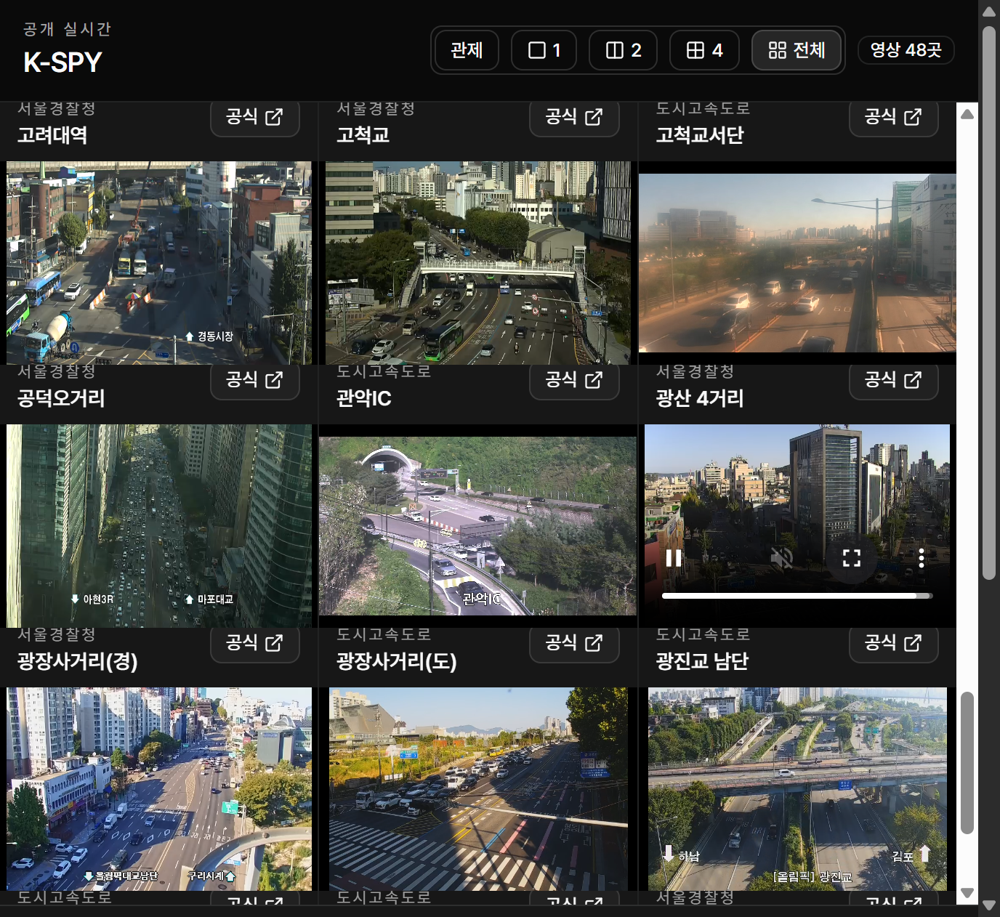
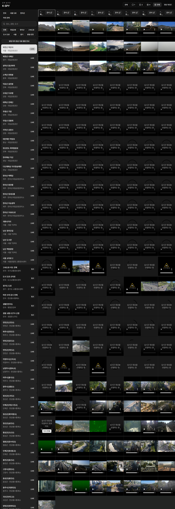

# K-SPY — 한국을 켜다.



<p align="center"><strong>이 화면, 전부 실제 CCTV.</strong><br/>탭을 수십 개 열 필요 없이. 한국을 한 화면에.</p>

<details>
<summary><strong>193개 카메라를 펼친 전체 캡처 보기</strong></summary>



2026-09-16 실제 실행 화면. 전체 배치를 담기 위해 캡처할 때만 8열로 펼쳤다. 연결 대기·제공처 점검 화면도 그대로 포함한다.

</details>

<p align="center"><strong>브라우저 하나. 전국의 공개 CCTV.</strong><br/>도시의 도로부터 한라산, 강을 건너는 다리까지.</p>

<p align="center"><a href="#바로-실행">지금 켜보기</a> · <a href="#화면">관제 모드</a> · <a href="SETUP.md">설치 가이드</a></p>

## 한국을 한 화면에

서울의 교차로. 한라산의 하늘. 다리 아래 흐르는 강.

따로 열어보던 카메라를 **한 화면에 펼치면, 익숙한 한국이 다르게 보인다.**

지도를 누르면 그곳의 카메라로. `관제`를 켜면 지도와 네 개의 영상이 함께. `전체`를 누르면 현재 필터의 모든 LIVE가 영상 벽으로 펼쳐진다.

**보고 싶은 지역을 고르고, 한국을 켜보세요.**

## 화면

| 모드 | 이렇게 본다 |
| --- | --- |
| **관제** | 한국 지도와 CCTV 4개를 함께 |
| **1 · 2 · 4** | 선택한 카메라에 집중 |
| **전체** | 현재 필터의 모든 LIVE를 동시에 |
| **빠른 탐색** | 전국 · 서울 도로 · 한라산 · 하천으로 바로 이동 |

국립공원 · 한라산 · 서울 교통 · 고속도로 · 하천 수위 감시의 공개 영상을 모은다. 지도에서 카메라를 고르고, 이름·좌표를 확인하고, 원하는 화면으로 전환한다. 모바일에서도 사용할 수 있다.

동시 시청 개수에 앱 자체 상한은 없다. 실제 재생은 제공처 상태와 기기·네트워크 성능에 따라 달라진다.

## 바로 실행

Node.js 22.13 이상에서:

```bash
git clone https://github.com/JSap0914/k-spy.git
cd k-spy
npm install
npm run dev
```

**[localhost:3000 열기](http://localhost:3000)**

고속도로 연동에는 `ITS_API_KEY`가 필요하다. 환경 설정·키 발급·지원 범위는 **[SETUP.md](SETUP.md)**에서 확인할 수 있다.

---

관제 탐색 방식 참고: [God’s Eye View](https://github.com/bilawalsidhu/gods-eye-view).
