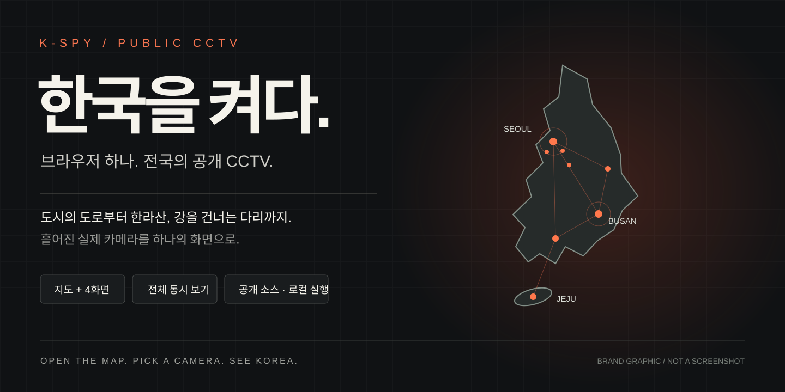

# K-SPY — 한국을 켜다.



<p align="center"><strong>브라우저 하나. 전국의 공개 CCTV.</strong><br/>도시의 도로부터 한라산, 강을 건너는 다리까지.</p>

<p align="center"><a href="#바로-실행">지금 켜보기</a> · <a href="SETUP.md">설치 가이드</a> · <a href="#화면">관제 모드</a> · <a href="#골목-방범-cctv도-볼-수-있나">공개 범위</a></p>

## 이게 원래 공개돼 있었다고?

서울의 교차로. 한라산의 하늘. 다리 아래 흐르는 강.

따로 열어보던 카메라를 **한 화면에 펼치면, 익숙한 한국이 다르게 보인다.**

지도를 누르면 그곳의 카메라로. `관제`를 켜면 지도와 네 개의 영상이 함께. `전체`를 누르면 현재 필터의 모든 LIVE가 영상 벽으로 펼쳐진다.

**보고 싶은 지역을 고르고, 한국을 켜보세요.**

| 지도에서 고르고 | 네 곳을 동시에 | 한 번에 펼치고 |
| --- | --- | --- |
| 한국 중심 지도 · 카메라 이름과 좌표 | 지도 + 4개 CCTV 관제 | 1 · 2 · 4 · 전체 병렬 시청 |
| 서울 도로 · 한라산 · 하천 빠른 탐색 | 실제 카메라 영상 재생 | 앱에서 정한 동시 시청 개수 상한 없음 |

<sub>위 이미지는 브랜드 그래픽입니다. 실제 앱 화면이나 카메라 위치를 정밀하게 재현한 지도가 아닙니다. 영상 제공처의 상태와 기기·네트워크 성능에 따라 재생 가능한 수가 달라집니다.</sub>

국립공원, 한라산, 서울 교통, 고속도로, 하천 수위 감시처럼 **공식적으로 공개된 실시간 영상**을 한 화면에 붙인다. 골목 방범은 실시간 여부와 관계없이 접근 가능한 위치 지도, 설치 데이터, 열람 안내도 모은다. 현재 연결된 골목 방범 실시간 영상은 없다.

저장소: https://github.com/JSap0914/k-spy

## 바로 실행

```bash
git clone https://github.com/JSap0914/k-spy.git
cd k-spy
npm install
copy .env.example .env.local
npm run dev
```

[http://localhost:3000](http://localhost:3000)

고속도로 탭까지 보려면 `.env.local`에 `ITS_API_KEY`를 넣는다. 키 발급, 화면 조작, 되는 것/안 되는 것까지는 [SETUP.md](SETUP.md)에 모아 두었다.

## 화면

- `관제`: 기본 모드. 지도와 선택한 CCTV 4개를 함께 본다. 모바일은 영상·목록·지도 순서로 배치한다.
- 지도는 한국 주변 범위(위도 32.5~38.9, 경도 124.3~132.1)로 이동을 제한한다. 제주·울릉도·독도 범위를 포함하며, 주변 국가를 지도에서 완전히 마스킹하는 방식은 아니다.
- CARTO 키 요구 타일을 OpenStreetMap 표준 타일로 교체했다. 표시 중인 지도 타일만 요청하고 출처를 유지한다. 대규모 공개 운영에서는 [타일 사용 정책](https://operations.osmfoundation.org/policies/tiles/)에 맞는 제공처를 선택해야 한다.
- `전체` 분류는 하천·기본 카메라와 불러온 서울·고속도로 목록을 함께 표시한다. 지도는 현재 분류의 모든 영상 지점을 표시한다. 표시 개수는 등록된 영상 수이며 현재 재생 성공 수가 아니다.

- 빠른 탐색: 전국 / 서울 도로 / 한라산 / 하천 관제. 검색을 초기화하고 지도와 카메라를 함께 전환한다.
- 지도: 선택한 카메라 이름·등록 좌표, 지점 이름 툴팁, `전체 지점 보기`를 제공한다. 모바일에서도 목록 아래 지도를 볼 수 있다.

- `1` `2` `4`: 고른 카메라만 동시에 재생
- `전체`: 지금 필터된 LIVE를 한 페이지에 전부 켠다

### 참고한 관제 탐색 방식

[God's Eye View](https://github.com/bilawalsidhu/gods-eye-view)의 대상 중심 탐색·관제 정보 표시·전체 보기 복귀 방식을 참고했다. K-SPY에서는 기존 Leaflet과 UI 컴포넌트로 빠른 탐색, 이름·좌표 표시, 전체 지점 복귀를 구현했다. 첫 지도 초기화 전에 마커 갱신이 끝나던 문제도 수정했다. 참고 프로젝트의 3D 엔진·데이터·영상은 복사하지 않았고 새 의존성을 추가하지 않았다. 이 변경은 탐색 개선이며 새 CCTV 소스 추가가 아니다.

## 골목 방범 CCTV도 볼 수 있나?

**[방범·공개자료](http://localhost:3000/resources)** 페이지에 확인한 공식 접근 경로 5개를 모았다. 메인 화면의 `방범 위치·영상 자료·열람 안내` 버튼으로도 열린다. 자료 종류와 지역·기관·내용으로 검색할 수 있다.

| 포함 자료 | 접근 방식 |
| --- | --- |
| 전국 CCTV 설치 정보 | 공식 CSV 다운로드 페이지 |
| 안양 골목·아동보호구역 방범 위치 | 공식 위치 지도 |
| 생활안전지도 | 공식 지도 |
| 연천군 개인영상정보 열람 절차 | 보관 영상 열람 안내. 승인된 영상 자체를 공개하는 페이지는 아님 |
| UTIC 교통 CCTV 신청 | 인증키 신청·결과 조회 |

이 자료들은 공식 사이트로 연결한다. 위치 데이터를 허브 지도에 전부 적재하거나 학습 영상 원본을 재호스팅한 상태는 아니다. 실시간 동시 재생 개수에도 포함하지 않는다.

자료 페이지 상단에서는 기존 한강홍수통제소 카메라를 선택해 실제 CCTV 영상을 바로 재생할 수 있다. 2026-09-15 브라우저에서 연천군(신천교) 촬영 화면을 확인했다. 교육·연출 영상은 플레이어와 자료 목록에서 제외했다. 이 변경으로 골목 방범 영상이 새로 확보된 것은 아니다.

2026-09-15 확인 기준, 이번 조사에서 허브에 추가할 수 있는 공식 골목 방범 실시간 스트림은 확인하지 못했다. 전국 모든 카메라가 막혔다고 확인한 것은 아니다. 공개 소스가 확인되면 추가 대상이다.

| 대상 | 확인한 공개 범위 | K-SPY 상태 |
| --- | --- | --- |
| 골목 방범 실시간 영상 | 이번 조사에서 공식 공개 스트림 미확인 | 연결 0개, 신규 추가 0개 |
| 전국 CCTV 표준데이터 | 설치 위치·목적·대수 등 시설 정보 | 실시간 재생 소스로 사용할 수 없음 |
| UTIC CCTV | 교통관제용 실시간 영상, 인증키 신청 필요 | 골목 방범 영상에 대한 승인이 아님 |
| 하천 수위 감시 | 한강홍수통제소 공개 영상 | 기존 `방범·안전` 탭에 연결됨 |

`방범·안전`이라는 탭 이름이 골목 방범 영상 지원을 뜻하지는 않는다. 현재 이 탭의 실시간 영상은 하천 수위 감시이며, 위치 안내 사이트는 `링크`로 구분한다.

확인 근거: [전국CCTV표준데이터](https://www.data.go.kr/data/15013094/standard.do), [UTIC 개방데이터 범위](https://www.utic.go.kr/guide/newUtisData.do), [UTIC 신청 조건](https://www.utic.go.kr/guide/newUtisDataWrite.do).

지자체 사례로 [안양 스마트 도시지도](https://smart.anyang.go.kr/smart/map/main?fcltType=cctvPes,cctvCrm)의 일반구역·아동보호구역 방범 CCTV는 `시설물 위치 확인` 항목이다. 이번 확인에서 방범 영상 재생 주소는 확보하지 못했다. 성남·김포 지도도 조사했지만, 골목 방범 공개 스트림으로 검증하지 못해 LIVE 추가 근거에서 제외했다.

### 공개 카메라 추가 기준

- 운영기관이 공개한 시청 페이지와 실제 영상 주소를 확인한다. 위치 데이터만으로 LIVE를 만들지 않는다.
- 외부 사이트 연동 조건을 확인한다. 인증이 필요하면 발급받은 권한 범위에서 연결한다.
- HLS 목록뿐 아니라 영상 조각 로드와 브라우저 재생까지 확인한 뒤 LIVE로 추가한다. 공식 페이지에서만 볼 수 있으면 링크로 구분한다.
- 골목 방범이라는 이유로 제외하지 않는다. 공개 영상이 확인되지 않은 카메라를 연결 완료로 표시하지 않는다.

